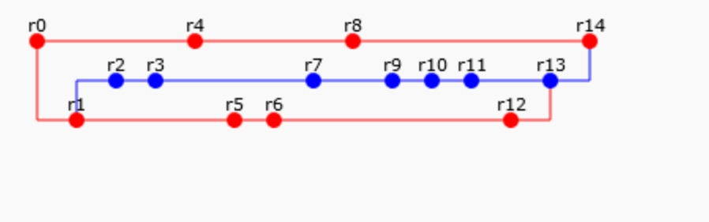

# lab №2

 Сконфигурировать в своём домашнем каталоге репозитории svn и git и загрузить в них начальную ревизию файлов с исходными кодами (в соответствии с выданным вариантом).

Воспроизвести последовательность команд для систем контроля версий svn и git, осуществляющих операции над исходным кодом, приведённые на блок-схеме.

При составлении последовательности команд необходимо учитывать следующие условия:

- Цвет элементов схемы указывает на пользователя, совершившего действие (красный - первый, синий - второй).

- Цифры над узлами - номер ревизии. Ревизии создаются последовательно.
 
- Необходимо разрешать конфликты между версиями, если они возникают.

